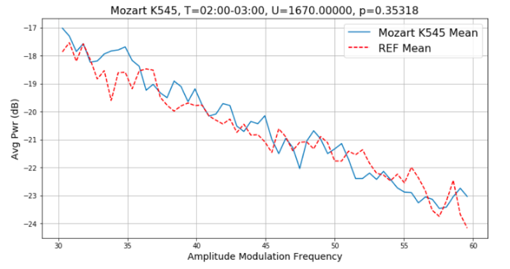
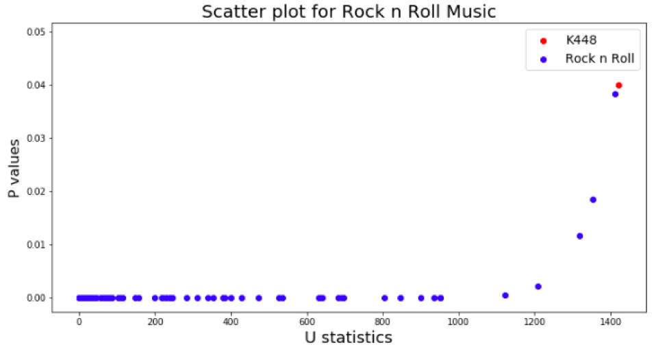
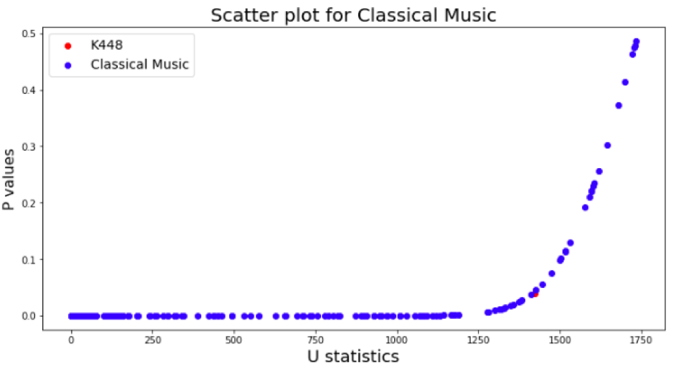
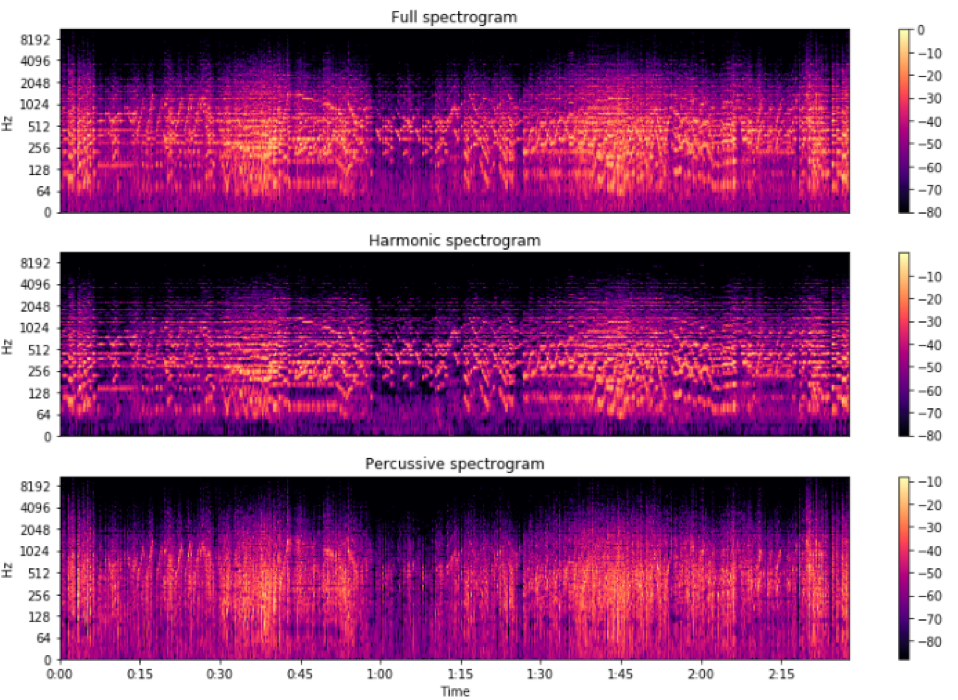
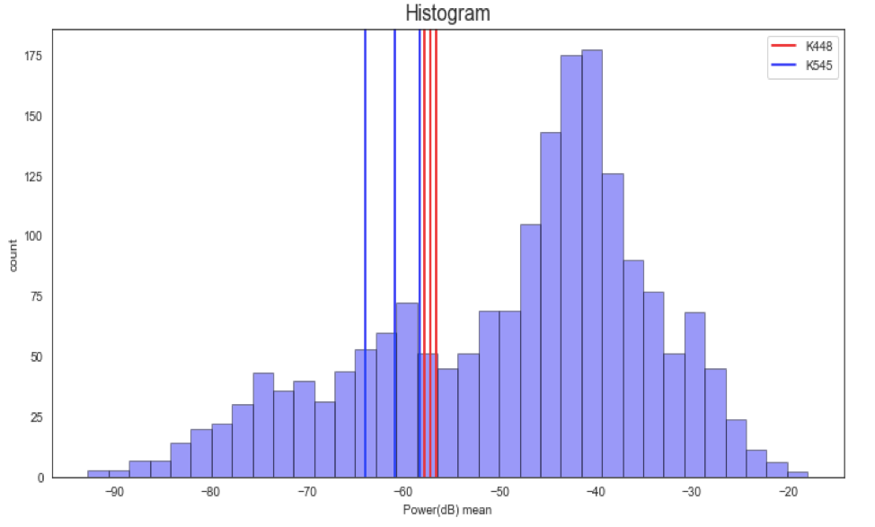
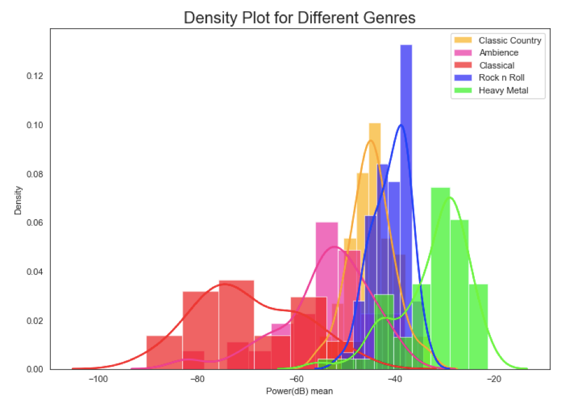

# Music and Epilepsy project: Mean Modulation Spectrum, Mozart K448 and 545
## PI - Michael Casey
## Lab - Bregman Lab, Dartmouth College

Michael’s research is based of works on music understanding by humans and machine, how the human brain represents music, theories of music and mind, and neural encoding of musical sound from human brain imaging. The lab in this domain mainly aims to research the mental representation underlying music perception and cognition as well as the mechanism underlying the musical affect. 

I was involved in the Music and Epilepsy project which is led by Michael Casey from Music department and Dr. Barbara Jobst from the Neuroscience department. Other members who are part of this project other than me were Robert J. Quon (Phd student) and Armond Dorsey (Undergraduate). Robert was responsible for getting the ECOG data from epileptic patients admitted in Dartmouth Hitchock Medical Centre and playing the pieces to the patients. Armond was mainly involved in ripping the audio and musical stimuli and organizing them for different genres like Classical music, Country, Rock n’ Roll, Heavy Metal, Ambience etc to restore the quality of audio. My role involved in communicating with both of them, bridging the gap between music and neuroscience. I analyzed the music data that Armond ripped, looking at musical properties with Michael’s help and came up with musical stimuli’s that are most and least similar to the anti-epileptic music, extracted mean modulatin spectrum from engineered stimulis so that Robert could play it to the epileptic patients, record the ECOG data and we can test the hypothesis about that musical characteristic.

### Background
Epilepsy is a neurological disorder in which brain activity becomes abnormal, causing seizures, periods of unusual behavior, sensations and sometimes loss of awareness. We were looking for an alternative, non-invasive treatment option and we believed that music can be one of them.
Musical stimuli that are engineered for persons with epilepsy present a compelling alternative to current invasive neuromodulation techniques for regulating abnormal epileptiform brain rhythms, such as interictal epileptiform activity (IEA). IEA is associated with increased seizure frequency and impaired cognition [1,2], which are both predictive factors of a poor quality of life in persons with epilepsy.  One feature considered inherent to this is that ‘suppression of epileptic activity may improve cognition and behavior.’ From our analysis we are trying to show how with the ability of music, we can decrease neuronal discharge and thus reduce seizures. 
Mozart’s Sonata for Two Pianos (K.448) is recognized for its anti-epileptogenic effects [3,4] such as its reductions in IEA[5]. Lin et al. (2011) reported a long-term reduction in IEA and seizures in response to sustained exposure to Mozart K.448[6]. In order to test this theory, we looked for physical features of Mozart K.448 that may explain its benefits to listeners.

### Results 

Figure 1: It shows the third minute of Mozart K545 is convergent to the average of three-minute segment of Mozart K448 in modulation frequency range of [30,60]. Here REF is Mozart K448

Figure 2.1: It shows the scatter plot for p values and U statistics of 314 Rock n Roll music corpus

Figure 2.2: It shows the scatter plot for p values and U statistics of
257 Classical music corpus

Figure 3.1: Shows the separation of harmonic and percussions from the modulation spectrogram 

Figure 3.2: Shows the bimodal distribution in all the one-minute segment of all the pieces collected after removal of percussions

Figure 3.3: Shows the density plot for different genres based on average modulation power spectrum

### Implications of work 
As a team we had to come up with the songs that we want to test with epileptic patients. We will be testing our hypothesis of modulation spectrum being the main property of a musical stimuli behind reducing the interictal spikes by playing one song with the highest U statistics or in other words a song that is the closest to K448 in terms of modulation spectrum and another song that is least similar to K448(lowest p value / U statistic) from each genre. Another hypothesis that we are testing is if we can create a classifier based on the amount of power in modulation on average present in a piece. 

### References 
1.	Chapman KE, Specchio N, Shinnar S, Holmes GL. Seizing control of epileptic activity can improve outcome.
2.	Epilepsia. 2015 Oct;56(10):1482–1485. Holmes GL, Lenck-Santini P-P. Role of interictal epileptiform abnormalities in cognitive impairment. Epilepsy & Behavior. 2006 May;8(3):504–515.
3.	Lin L-C, Lee M-W, Wei R-C, Mok H-K, Yang R-C. Mozart K.448 listening decreased seizure recurrence and epileptiform discharges in children with first unprovoked seizures: a randomized controlled study. BMC Complementary and Alternative Medicine [Internet]. 2014 Dec [cited 2018 Jul 25];14(1).
4.	Jaušovec N, Habe K. The “Mozart Effect”: An Electroencephalographic Analysis Employing the Methods of Induced Event-Related Desynchronization/Synchronization and Event-RelateCoherence. Brain Topography. 2003;16(2):73–84.
5.	Turner RP. The acute effect of music on interictal epileptiform discharges. Epilepsy & Behavior. 2004 Oct;5(5):662–668.
6.	Lin L-C, Lee W-T, Wu H-C, Tsai C-L, Wei R-C, Mok H-K, Weng C-F, Lee M, Yang R-C. The long-term effect of listening to Mozart K.448 decreases epileptiform discharges in children with epilepsy. Epilepsy & Behavior. 2011 Aug;21(4):420–424.

